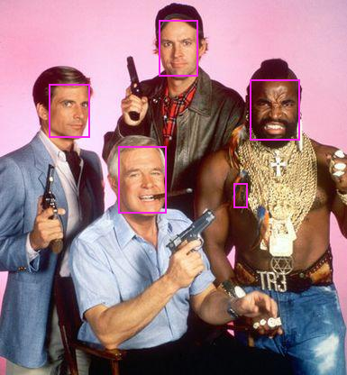

# Installing OpenVino toolkit

## Download the Intel OpenVINO toolkit

You can download the tookit from:

+ [Intel Open Source Technology Center (Raspbian)](https://download.01.org/opencv/2020/openvinotoolkit/).
+ [Intel Deep Learning & Vision Tools (Linux/Windows/macOS)](https://software.intel.com/content/www/us/en/develop/tools/openvino-toolkit/choose-download.html)

The OpenVINO toolkit for Raspbian OS is distributed without installer so the installation is different from the Linux installation.

## Raspbian

To install the OpenVino toolkit you should modify **group_vars/movidius.yml** to fit your environment.

This playbook will install the OpenVino on Raspberry pi 3 (Debian Buster).

You will have to have an entry in the **inventory** file for the system where you want to install:

```
$ cat inventory
[raspberry3]
192.168.1.59 ansible_user=pi

[rsp1movidius]
192.168.1.211 ansible_user=pi

[x86_64]
192.168.1.211 ansible_user=jadebustos

[x240]
192.168.1.211 ansible_user=jadebustos
$
```

```
$ ansible-playbook -i inventory -l rsp1movidius install-openvino.yml
```

The OpenVINO will be downloaded and partially installed.

After that log in the system:

```
$ ssh pi@rsp1movidius.lab
Linux rsp1movidius.lab 4.19.97-v7+ #1294 SMP Thu Jan 30 13:15:58 GMT 2020 armv7l

The programs included with the Debian GNU/Linux system are free software;
the exact distribution terms for each program are described in the
individual files in /usr/share/doc/*/copyright.

Debian GNU/Linux comes with ABSOLUTELY NO WARRANTY, to the extent
permitted by applicable law.
Last login: Mon May 11 22:17:17 2020 from 192.168.1.42
[setupvars.sh] OpenVINO environment initialized
pi@rsp1movidius:~ $ sh /opt/intel/openvino/install_dependencies/install_NCS_udev_rules.sh
Update udev rules so that the toolkit can communicate with your neural compute stick
[install_NCS_udev_rules.sh] udev rules installed
pi@rsp1movidius:~ $ 
```

Now you can plug the Intel Movidius Neural Compute Stick.

### Build and Run Object Detection Sample

```
pi@rsp1movidius:~ $ cd movidius/openvino/build/
pi@rsp1movidius:~/openvino/build $ cmake -DCMAKE_BUILD_TYPE=Release -DCMAKE_CXX_FLAGS="-march=armv7-a" /opt/intel/openvino/deployment_tools/inference_engine/samples
-- /etc/*-release distrib: Raspbian 9
-- Found InferenceEngine: /opt/intel/openvino/deployment_tools/inference_engine/lib/raspbian_9/armv7l/libinference_engine.so (Required is at least version "1.5") 
-- Performing Test HAVE_CPUID_INFO
-- Performing Test HAVE_CPUID_INFO - Failed
-- OMP Release lib: OMP_LIBRARIES_RELEASE-NOTFOUND
-- OMP Debug lib: OMP_LIBRARIES_DEBUG-NOTFOUND
CMake Warning at /opt/intel/openvino/deployment_tools/inference_engine/share/InferenceEngineConfig.cmake:31 (message):
  Intel OpenMP not found.  Intel OpenMP support will be disabled.
  IE_THREAD_SEQ is defined
Call Stack (most recent call first):
  /opt/intel/openvino/deployment_tools/inference_engine/share/ie_parallel.cmake:78 (ext_message)
  /opt/intel/openvino/deployment_tools/inference_engine/src/extension/CMakeLists.txt:28 (set_ie_threading_interface_for)


-- Looking for C++ include unistd.h
-- Looking for C++ include unistd.h - found
-- Looking for C++ include stdint.h
-- Looking for C++ include stdint.h - found
-- Looking for C++ include sys/types.h
-- Looking for C++ include sys/types.h - found
-- Looking for C++ include fnmatch.h
-- Looking for C++ include fnmatch.h - found
-- Looking for C++ include stddef.h
-- Looking for C++ include stddef.h - found
-- Check size of uint32_t
-- Check size of uint32_t - done
-- Looking for strtoll
-- Looking for strtoll - found
-- Configuring done
-- Generating done
-- Build files have been written to: /home/pi/movidius/openvino/build
pi@rsp1movidius:~/openvino/build $ make -j2 object_detection_sample_ssd
...
[100%] Built target object_detection_sample_ssd
pi@rsp1movidius:~/openvino/build $ 
```

Run the sample with specifying the model and a path to the input image:

```
pi@rsp1movidius:~/openvino/build $ ./armv7l/Release/object_detection_sample_ssd -m ../pretrained/face-detection-adas-0001.xml -d MYRIAD -i ../images/The-A-Team.jpg 
...
pi@rsp1movidius:~/openvino/build $ [ INFO ] Execution successful
pi@rsp2movidius:~/movidius/openvino/build $ ls -lh
| grep bmp
-rw-r--r-- 1 pi pi 3,9M jun  2 22:13 out_0.bmp
pi@rsp1movidius:~/openvino/build $ 
```

You should get a bmp image with faces enclosed in rectangles:



> Including the face-feathered B.A's nipple!!!

### Run Inference of Face Detection Model using OpenCV API

```
pi@rsp1movidius:~/movidius/openvino/build $ cd ../pretrained/
pi@rsp1movidius:~/movidius/openvino/pretrained $ ls
face-detection-adas-0001.bin  face-detection-adas-0001.xml  openvino_fd_myriad.py
pi@rsp1movidius:~/movidius/openvino/pretrained $ python3 openvino_fd_myriad.py 
Traceback (most recent call last):
  File "openvino_fd_myriad.py", line 3, in <module>
    net = cv.dnn_DetectionModel('face-detection-adas-0001.xml',
AttributeError: module 'cv2' has no attribute 'dnn_DetectionModel'
pi@rsp1movidius:~/movidius/openvino/pretrained $
```

It will fail on Raspbian due to OpenVINO 4.1.2+ is needed:

```
(movidius) pi@rsp1movidius:~/.virtualenvs $ python
Python 3.5.3 (default, Sep 27 2018, 17:25:39) 
[GCC 6.3.0 20170516] on linux
Type "help", "copyright", "credits" or "license" for more information.
>>> import cv2
>>> cv2.__version__
'4.0.1-openvino'
>>
```

### Build the Neural Compute App Zoo examples

This repository has examples to teach you how the NCS SDK mand Movidius stick can be used to train and process neural networks more efficiently than using CPUs.

Build the examples. **scikit-image** is needed:

```
pi@rsp1movidius:~ $ cd movidius/
pi@rsp1movidius:~/movidius $ cd ncappzoo/
pi@rsp1movidius:~/movidius/ncappzoo $ make
...
pi@rsp1movidius:~/movidius/ncappzoo $
```

Make a caffe GoogleImageNet graph:

```
pi@rsp1movidius:~/movidius/ncappzoo $ cd networks
pi@rsp1movidius:~/movidius/ncappzoo/networks $ make 
pi@rsp1movidius:~/movidius/ncappzoo/networks $
```

## x86_64

> https://docs.openvinotoolkit.org/latest/_docs_install_guides_installing_openvino_linux.html

### Build the Neural Compute App Zoo examples

This repository has examples to teach you how the NCS SDK mand Movidius stick can be used to train and process neural networks more efficiently than using CPUs.

After installing OpenVINO toolkit you can compile it. Be certain that you initialize the OpenVINO environment. After installing OpenVINO you can finish your ssh session and open a new one to initialize the OpenVINO environment.

Build the examples. **scikit-image** is needed:

```
pi@rsp1movidius:~ $ cd movidius/
pi@rsp1movidius:~/movidius $ cd ncappzoo/
pi@rsp1movidius:~/movidius/ncappzoo $ make
...
pi@rsp1movidius:~/movidius/ncappzoo $
```

Make a caffe GoogleImageNet graph:

```
pi@rsp1movidius:~/movidius/ncappzoo $ cd networks
pi@rsp1movidius:~/movidius/ncappzoo/networks $ make 
pi@rsp1movidius:~/movidius/ncappzoo/networks $
```

## Links

+ [Install OpenVINO toolkit for Raspbian OS - OpenVINO toolkit](https://docs.openvinotoolkit.org/latest/_docs_install_guides_installing_openvino_raspbian.html)
+ [Install OpenVINO toolkit for Linux - OpenVINO toolkit](https://docs.openvinotoolkit.org/latest/_docs_install_guides_installing_openvino_linux.html)
+ [How to set up the Movidius Neural Compute Stick](https://www.freecodecamp.org/news/how-to-set-up-the-intel-movidius-neural-compute-stick-b9db16d493a7/)